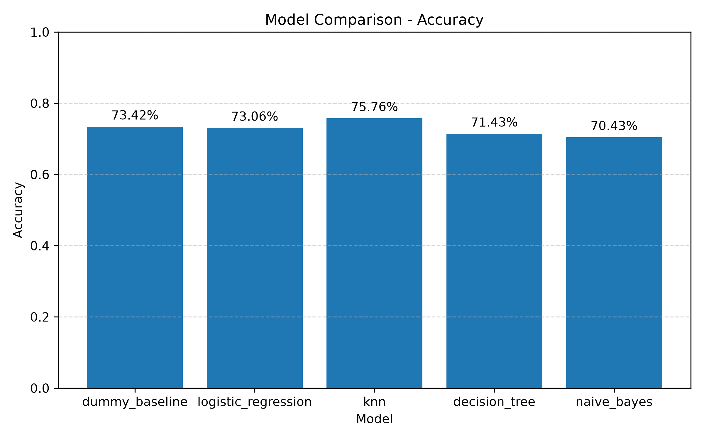
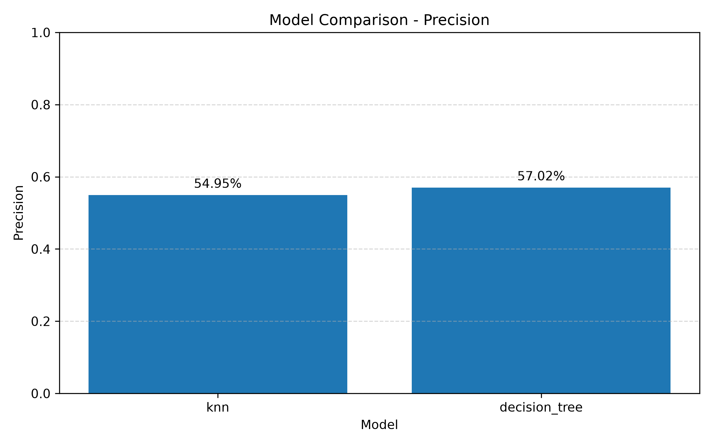
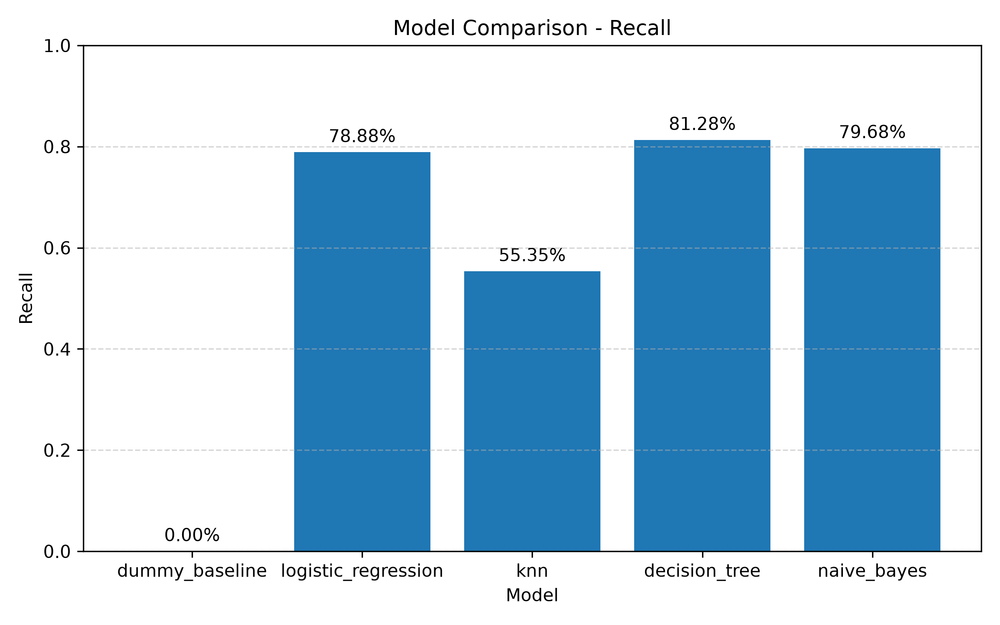
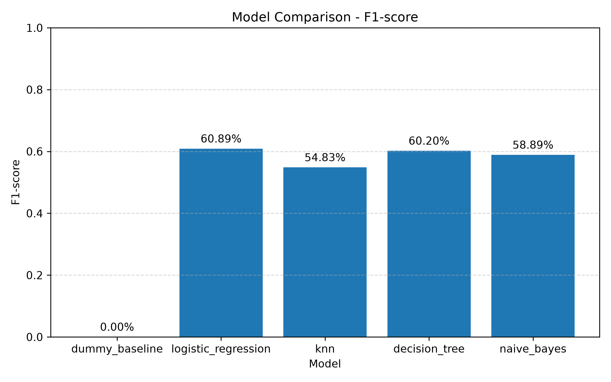
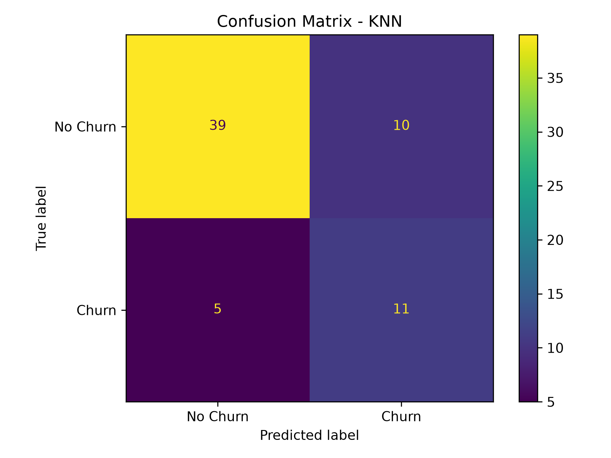
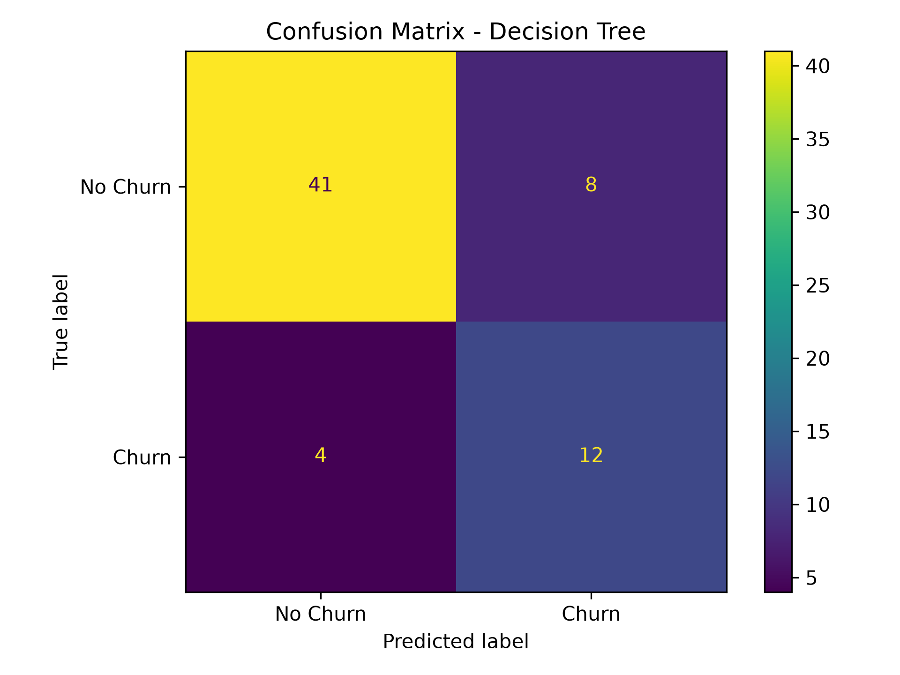

# \# 09_12523118_10123078_CustomerChurn

#

# \## Dự đoán khách hàng rời bỏ nhà mạng bằng Machine Learning – Classification

#

# \## 1. Giới thiệu đề tài

#

# Trong lĩnh vực viễn thông, việc khách hàng rời bỏ nhà mạng gây ảnh hưởng đến doanh thu và hoạt động kinh doanh.

#

# Đề tài này xây dựng mô hình Machine Learning nhằm dự đoán khả năng khách hàng rời bỏ nhà mạng dựa trên các thông tin như:

#

# \- Giới tính

# \- Độ tuổi

# \- Thời gian sử dụng dịch vụ

# \- Loại hợp đồng

# \- Phí sử dụng hàng tháng

# \- Tổng chi phí

# \- Các dịch vụ Internet và hỗ trợ

#

# Bài toán thuộc dạng \*\*Classification\*\*, trong đó mô hình dự đoán khách hàng có rời bỏ nhà mạng hay không.

#

# \---

#

# \## 2. Mục tiêu đề tài

#

# \- Phân tích dữ liệu khách hàng viễn thông.

# \- Tiền xử lý dữ liệu trước khi huấn luyện.

# \- Xây dựng mô hình K-Nearest Neighbors.

# \- Xây dựng mô hình Decision Tree.

# \- Đánh giá mô hình bằng các chỉ số Accuracy, Precision, Recall và F1-score.

# \- Dự đoán khả năng rời bỏ của khách hàng mới.

#

# \---

#

# \## 3. Dataset

#

# Dataset sử dụng là bộ dữ liệu Telco Customer Churn.

#

# Thông tin chính:

#

# \- Số dòng ban đầu: 7043

# \- Số dòng sau khi xử lý dữ liệu: 7032

# \- Biến mục tiêu: `Churn Label`

#

# Quy ước nhãn:

#

# | Giá trị | Ý nghĩa |

# |---|---|

# | 0 | Khách hàng không rời bỏ |

# | 1 | Khách hàng rời bỏ |

#

# Dữ liệu được lưu tại:

#

# ```text

# data/telco_churn.csv

# ```

#

# \---

#

# \## 4. Công nghệ sử dụng

#

# \- Python

# \- Pandas

# \- NumPy

# \- Scikit-learn

# \- Matplotlib

# \- Joblib

# \- Git và GitHub

#

# \---

#

# \## 5. Quy trình thực hiện

#

# \### Bước 1: Thu thập dữ liệu

#

# Sử dụng dataset Telco Customer Churn.

#

# \### Bước 2: Tiền xử lý dữ liệu

#

# \- Đọc dữ liệu CSV với dấu phân cách `;`.

# \- Chuyển đổi cột `Total Charges` sang kiểu số.

# \- Loại bỏ các dòng không hợp lệ ở cột `Total Charges`.

# \- Loại bỏ các cột không cần thiết như mã khách hàng, thông tin địa lý và các cột có khả năng gây rò rỉ dữ liệu.

# \- Chuyển đổi nhãn `Churn Label` thành dạng số:

# &#x20; - `No = 0`

# &#x20; - `Yes = 1`

# \- Mã hóa các biến phân loại bằng OneHotEncoder.

# \- Chuẩn hóa các biến số bằng StandardScaler.

# \- Xử lý dữ liệu thiếu bằng SimpleImputer.

#

# \### Bước 3: Chia dữ liệu

#

# Dữ liệu được chia thành:

#

# \- 80% dữ liệu huấn luyện.

# \- 20% dữ liệu kiểm tra.

#

# Thông số sử dụng:

#

# ```python

# test_size=0.2

# random_state=42

# stratify=y

# ```

#

# \### Bước 4: Huấn luyện mô hình

#

# Hai mô hình được triển khai:

#

# 1\. K-Nearest Neighbors

# 2\. Decision Tree

#

# \### Bước 5: Đánh giá mô hình

#

# Sử dụng các metrics:

#

# \- Accuracy

# \- Precision

# \- Recall

# \- F1-score

# \- Confusion Matrix

#

# \---

#

# \## 6. Các mô hình Machine Learning

#

# \### 6.1. K-Nearest Neighbors

#

# KNN dự đoán nhãn của một khách hàng bằng cách tìm các khách hàng gần nhất trong dữ liệu huấn luyện.

#

# Trong đề tài này, mô hình sử dụng:

#

# ```python

# KNeighborsClassifier(n_neighbors=5)

# ```

#

# \### 6.2. Decision Tree

#

# Decision Tree sử dụng cấu trúc cây quyết định để phân loại khách hàng dựa trên các điều kiện của dữ liệu.

#

# Trong đề tài này, mô hình sử dụng:

#

# ```python

# DecisionTreeClassifier(

# &#x20; max_depth=5,

# &#x20; random_state=42

# )

# ```

#

# \---

#

# \## 7. Kết quả thực nghiệm

#

# Kết quả đánh giá hai mô hình:

#

# | Model | Accuracy | Precision | Recall | F1-score |

# |---|---:|---:|---:|---:|

# | KNN | 76.12% | 54.95% | 56.42% | 55.67% |

# | Decision Tree | 77.90% | 57.02% | 68.45% | 62.21% |

#

# \### Nhận xét

#

# \- Decision Tree đạt Accuracy cao hơn KNN.

# \- Decision Tree có Precision, Recall và F1-score cao hơn KNN.

# \- Recall của Decision Tree đạt 68.45%, cho thấy mô hình phát hiện được nhiều khách hàng có khả năng rời bỏ hơn.

# \- Đối với bài toán Customer Churn, Recall là chỉ số đáng chú ý vì việc bỏ sót khách hàng có nguy cơ rời bỏ có thể gây ảnh hưởng đến doanh nghiệp.

#

# Lưu ý: Kết quả trên được đánh giá trên tập dữ liệu kiểm tra và không đảm bảo dự đoán chính xác tuyệt đối cho mọi khách hàng thực tế.

#

# \---

#

# \## 8. Cấu trúc thư mục

#

# ```text

# 09_12523118_10123078_CustomerChurn

# │

# ├── ai-models

# │ ├── decision_tree_model.pkl

# │ ├── knn_model.pkl

# │ ├── model_comparison.csv

# │ └── telco_churn_logistic_model.pkl

# │

# ├── data

# │ └── telco_churn.csv

# │

# ├── docs

# │ ├── baocao.docx

# │ └── figures

# │ ├── accuracy.png

# │ ├── precision.png

# │ ├── recall.png

# │ ├── f1_score.png

# │ ├── confusion_matrix_knn.png

# │ └── confusion_matrix_decision_tree.png

# │

# ├── notebooks

# │ └── eda.py

# │

# ├── src

# │ ├── confusion_matrix.py

# │ ├── data_preprocessing.py

# │ ├── evaluate_models.py

# │ ├── predict.py

# │ ├── show_results.py

# │ └── train_model.py

# │

# ├── .gitignore

# ├── README.md

# └── requirements.txt

# ```

#

# \---

#

# \## 9. Cách cài đặt

#

# Clone repository:

#

# ```bash

# git clone https://github.com/TaDucHuy0810/09\_12523118\_10123078\_CustomerChurn.git

# ```

#

# Di chuyển vào thư mục project:

#

# ```bash

# cd 09_12523118_10123078_CustomerChurn

# ```

#

# Cài đặt thư viện:

#

# ```bash

# pip install -r requirements.txt

# ```

#

# \---

#

# \## 10. Cách chạy project

#

# \### Huấn luyện mô hình

#

# ```bash

# python src/train_model.py

# ```

#

# \### Tạo biểu đồ đánh giá

#

# ```bash

# python src/evaluate_models.py

# ```

#

# \### Tạo Confusion Matrix

#

# ```bash

# python src/confusion_matrix.py

# ```

#

# \### Hiển thị bảng kết quả

#

# ```bash

# python src/show_results.py

# ```

#

# \### Dự đoán khách hàng thử nghiệm

#

# ```bash

# python src/predict.py

# ```

#

# \---

#

# \## 11. Kết quả đầu ra

#

# Các model được lưu tại:

#

# ```text

# ai-models/

# ```

#

# Các biểu đồ đánh giá được lưu tại:

#

# ```text

# docs/figures/

# ```

#

# Các file model có thể được sử dụng để dự đoán dữ liệu khách hàng mới mà không cần huấn luyện lại từ đầu.

#

# \---

#

# \## 12. Hướng phát triển

#

# Trong tương lai, đề tài có thể được phát triển thêm:

#

# \- Bổ sung Logistic Regression và Random Forest.

# \- So sánh nhiều mô hình Machine Learning.

# \- Tối ưu tham số bằng GridSearchCV hoặc RandomizedSearchCV.

# \- Xử lý mất cân bằng dữ liệu.

# \- Xây dựng giao diện dự đoán bằng Streamlit hoặc FastAPI.

# \- Triển khai mô hình lên môi trường thực tế.

## Kết quả trực quan

### So sánh Accuracy



### So sánh Precision



### So sánh Recall



### So sánh F1-score



### Confusion Matrix của KNN



### Confusion Matrix của Decision Tree


