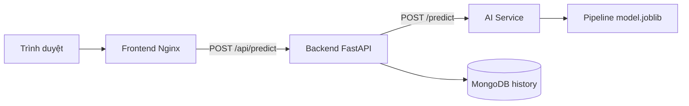

# Dự đoán khách hàng rời mạng (Customer Churn)

Ứng dụng Machine Learning phân loại khả năng khách hàng rời bỏ nhà mạng
Telco Customer Churn. Dự án gồm quy trình EDA, huấn luyện và đánh giá mô
hình, AI service, backend proxy, giao diện web và lưu lịch sử dự đoán.

> Đây là sản phẩm phục vụ học tập và minh họa kỹ thuật, không phải hệ thống
> quyết định tự động thay cho chuyên viên chăm sóc khách hàng.

## 1. Thành viên và phân công

| Họ và tên     |     MSSV | Phần việc                                                                                                                                                                                          |
| ------------- | -------: | -------------------------------------------------------------------------------------------------------------------------------------------------------------------------------------------------- |
| Tạ Đức Huy    | 12523118 | Phân tích khám phá dữ liệu; bổ sung dataset và DATA.md; xây dựng mã nguồn tiền xử lý, huấn luyện và đánh giá hai mô hình KNN và Naive Bayes; phát triển frontend và đóng gói frontend bằng Docker. |
| Trần Công Đàm | 10123078 | Xây dựng, huấn luyện hai mô hình Decision Tree và Logistic Regression; đánh giá, so sánh kết quả các mô hình; tích hợp AI/API và backend; cấu hình Docker Compose và kiểm thử hệ thống.            |

## 2. Bài toán

- **Loại bài toán:** phân loại nhị phân.
- **Đối tượng:** khách hàng sử dụng dịch vụ viễn thông.
- **Cột mục tiêu:** `Churn Label` (`No = 0`, `Yes = 1`).
- **Ý nghĩa:** ước lượng rủi ro rời mạng để hỗ trợ ưu tiên chăm sóc và giữ chân
  khách hàng.

Luồng xử lý:



## 3. Dữ liệu

- **Dataset:** Telco Customer Churn, 7.043 dòng ban đầu; 7.032 dòng sau khi loại bản ghi thiếu/không hợp lệ ở các trường nhãn và chi phí.
- **Đầu vào model:** 20 feature; từ điển dữ liệu, kiểu dữ liệu và miền giá trị quan sát được ghi trong [DATA.md](DATA.md).
- **File local:** `data/telco_churn.csv` (phân tách bằng dấu chấm phẩy).
- **Archive theo cấu trúc môn học:** `ai-models/data/dataset.zip`, kèm ghi chú tại `ai-models/data/DATA.md`.
- **Nguồn:** [IBM Telco Customer Churn trên Kaggle](https://www.kaggle.com/datasets/blastchar/telco-customer-churn); Kaggle ghi “Data files © Original Authors”, chưa xác minh license mở.
- **Ghi chú nguồn và xử lý:** [DATA.md](DATA.md).

`Monthly Charges` và `Total Charges` được chuyển sang số; các dòng không chuyển đổi được loại bỏ.
Các cột định danh, địa lý và cột được sinh từ nhãn như `Churn Value`,
`Churn Score`, `Churn Reason` không được đưa vào model để tránh leakage.

## 4. EDA và tiền xử lý

Notebook Colab canonical nằm trong [ai-models/colab/](ai-models/colab/); các
implementation dùng chung nằm trong [src/](src/):

| Nội dung         | File                                                          |
| ---------------- | ------------------------------------------------------------- |
| Khám phá dữ liệu | `ai-models/colab/01_eda.ipynb`, `notebooks/eda.py`            |
| Tiền xử lý       | `ai-models/colab/02_preprocess.ipynb`, `src/train_model.py`   |
| Huấn luyện       | `ai-models/colab/03_train.ipynb`, `src/train_model.py`        |
| Đánh giá         | `ai-models/colab/04_evaluate.ipynb`, `src/evaluate_models.py` |

Các hình EDA và confusion matrix được lưu tại [docs/figures/](docs/figures/).
Giải thích các quan sát và quyết định xử lý nằm trong [docs/EDA.md](docs/EDA.md).

Một số phát hiện trên 7.043 dòng gốc:

| Phân tích         | Quan sát                                                                 | Quyết định                                                                              |
| ----------------- | ------------------------------------------------------------------------ | --------------------------------------------------------------------------------------- |
| Phân bố Churn     | 5.174 khách hàng không rời mạng (73,46%); 1.869 rời mạng (26,54%).       | Dùng stratify và báo cáo Precision, Recall, F1, ROC-AUC cùng Accuracy.                  |
| Giới tính         | Tỷ lệ churn nữ 26,92%, nam 26,16%, chênh lệch nhỏ.                       | Giữ feature; không kết luận giới tính là nguyên nhân churn.                             |
| Hợp đồng          | Tỷ lệ churn month-to-month 42,71%, one-year 11,27%, two-year 2,83%.      | Giữ feature Contract dạng phân loại; xem là liên hệ, không khẳng định nhân quả.         |
| Thời gian sử dụng | Median tenure nhóm churn 10 tháng, nhóm không churn 38 tháng.            | Giữ Tenure Months dạng số và chuẩn hóa trong pipeline.                                  |
| Phí hàng tháng    | Median nhóm churn 79,65, nhóm không churn 64,43.                         | Chuyển sang số, giữ feature và scale trong pipeline.                                    |
| Thanh toán        | Electronic check có tỷ lệ churn 45,29%, cao hơn các phương thức còn lại. | Giữ Payment Method; cần xem cùng Contract/Internet Service để tránh diễn giải nhân quả. |
| Internet          | Fiber optic 41,89%, DSL 18,96%, không dùng Internet 7,40%.               | Giữ Internet Service dạng phân loại và One-Hot encode trong pipeline.                   |

Pipeline dùng split 80/20 có stratify. Imputer, OneHotEncoder và
StandardScaler được fit bên trong pipeline sau khi chia dữ liệu.

Thứ tự notebook canonical là `ai-models/colab/01_eda.ipynb` →
`02_preprocess.ipynb` → `03_train.ipynb` → `04_evaluate.ipynb`. Clone repository
và chạy notebook từ thư mục gốc; các notebook dùng chung source scripts để
schema, split, model và artifacts không bị lệch. `notebooks/` giữ lại các bản
exploration cũ, không phải luồng Run All hiện hành.

## 5. Kết quả mô hình

Các số dưới đây là kết quả trên holdout test (20%, stratified, random state
42); `CV F1` là F1 trung bình 5-fold trên tập train. Model được chọn theo CV
F1, không dùng test set để chọn. Mô hình đóng gói hiện tại là **Logistic
Regression** (GridSearchCV chọn `C=1.0`):

| Mô hình             | Accuracy | Precision | Recall |     F1 | ROC-AUC |  CV F1 |
| ------------------- | -------: | --------: | -----: | -----: | ------: | -----: |
| Dummy baseline      |   0.7342 |    0.0000 | 0.0000 | 0.0000 |  0.5000 | 0.0000 |
| Logistic Regression |   0.7306 |    0.4958 | 0.7888 | 0.6089 |  0.8428 | 0.6452 |
| KNN                 |   0.7576 |    0.5433 | 0.5535 | 0.5483 |  0.7846 | 0.5683 |
| Decision Tree       |   0.7143 |    0.4780 | 0.8128 | 0.6020 |  0.8302 | 0.6266 |
| Naive Bayes         |   0.7043 |    0.4671 | 0.7968 | 0.5889 |  0.8113 | 0.6214 |

Kết quả đầy đủ của các model nằm trong
[ai-models/model_comparison.csv](ai-models/model_comparison.csv) và
[ai-models/models/metadata.json](ai-models/models/metadata.json).
F1 là metric chính do lớp churn chiếm thiểu số; Dummy baseline dự đoán toàn bộ
mẫu là không churn nên Recall và F1 bằng 0.

## 6. Artifact model

| File                                            | Nội dung                                         |
| ----------------------------------------------- | ------------------------------------------------ |
| [model.joblib](ai-models/models/model.joblib)   | Pipeline tiền xử lý và classifier đã fit         |
| [schema.json](ai-models/models/schema.json)     | Feature, kiểu dữ liệu và miền giá trị            |
| [metadata.json](ai-models/models/metadata.json) | Version, split, CV, metric và phiên bản thư viện |

AI service nạp pipeline một lần khi container khởi động; backend không tự viết
lại logic tiền xử lý.

Chạy `python ai-models/src/train.py` để cập nhật `model_comparison.csv`,
`models/model.joblib`, `models/schema.json`, `models/metadata.json` và file
model tương thích cũ trong `ai-models/`. Chạy tiếp
`python ai-models/src/evaluate.py` để cập nhật biểu đồ metric và confusion
matrix từ cùng holdout split.

## 7. Cấu trúc repository

```text
app/backend/        Backend proxy, request ID, history và logging
app/frontend/       HTML, CSS, JavaScript, Dockerfile và Nginx proxy
ai-models/models/   model.joblib, schema.json, metadata.json
ai-models/data/     dataset.zip, DATA.md
ai-models/colab/    notebooks 01_eda đến 04_evaluate
ai-models/src/      preprocess/train/evaluate entry points
ai-models/service/  AI service FastAPI
data/               Dataset local
docs/               Báo cáo, EDA, hình và performance log
tests/              Schema và API contract tests
notebooks/          Notebook EDA, preprocess, train, evaluate
src/                Script huấn luyện và đánh giá
docker-compose.yml  Frontend, backend, AI service và MongoDB
```

README chi tiết của từng phần:

- [AI service](ai-models/README.md)
- [Backend](app/backend/README.md)
- [Frontend](app/frontend/README.md)

## 8. Chạy bằng Docker

Yêu cầu Docker Desktop với Linux containers. Từ thư mục gốc repository:

```powershell
if (-not (Test-Path .env)) { Copy-Item .env.example .env }
docker compose up --build -d
```

Nếu cổng `3000` đang được sử dụng, mở frontend ở cổng khác:

```powershell
$env:FRONTEND_PORT = "3001"
docker compose up --build -d
Remove-Item Env:FRONTEND_PORT
```

Địa chỉ mặc định:

| Thành phần      | URL                                                               |
| --------------- | ----------------------------------------------------------------- |
| Giao diện       | http://localhost:3000                                             |
| Backend health  | http://localhost:8000/health (status, port, uptime, dependencies) |
| AI health       | http://localhost:8001/health (status, port, uptime, model_loaded) |
| AI Swagger      | http://localhost:8001/docs                                        |
| Lịch sử dự đoán | http://localhost:8000/api/history                                 |

Kiểm tra container:

```powershell
docker compose ps
docker compose logs -f frontend backend ai-service
```

MongoDB dùng named volume `mongo_data`, có healthcheck `mongosh ping` và
backend chỉ khởi động sau khi MongoDB sẵn sàng. Không chạy
`docker compose down -v` nếu cần giữ lịch sử.

## 9. Huấn luyện, đánh giá và cập nhật artifact

```powershell
pip install -r requirements.txt
python ai-models/src/preprocess.py
python ai-models/src/train.py
python ai-models/src/evaluate.py
```

`train_model.py` đọc `data/telco_churn.csv`, chạy split 80/20 stratified,
tuning Logistic Regression và đánh giá Dummy baseline, Logistic Regression,
KNN, Decision Tree, Naive Bayes. Script chọn model theo CV F1 rồi ghi:
`ai-models/model_comparison.csv`, `ai-models/models/model.joblib`,
`ai-models/models/schema.json`, `ai-models/models/metadata.json` và
`ai-models/<model_name>_model.pkl`. `evaluate.py` tạo biểu đồ metric và bốn
confusion matrix từ cùng kết quả holdout. Sau khi đổi artifact, rebuild AI
service bằng `docker compose up --build -d ai-service`.

Chạy notebook theo thứ tự `01_eda` → `02_preprocess` → `03_train` →
`04_evaluate` trong `ai-models/colab/`; các cell gọi lại cùng script canonical.
Sau khi thay đổi được push lên GitHub, trong Google Colab clone repo public,
chuyển working directory về thư mục gốc, chạy `pip install -r requirements.txt`
rồi mở/chạy lần lượt bốn notebook từ đầu đến cuối. Không upload riêng notebook
vào `/content` vì notebook cần cả `data/`, `src/` và `docs/figures/`.

Kiểm tra cú pháp và test:

```powershell
python -m compileall -q src ai-models/service app/backend
python -m pytest -q
```

Test hiện bao phủ contract 20 feature, giá trị thiếu/lạ/sai miền, inference AI
và request ID của backend. Chạy `python -m pytest tests -q`.

## 10. API chính

### `POST /api/predict`

Frontend gửi object `features` đến backend. Backend chuyển tiếp request đến
AI service, thêm `request_id`, lưu lịch sử và trả về:

```json
{
  "prediction": 1,
  "label": "Churn",
  "probability": 0.73,
  "model_version": "1.0.0",
  "request_id": "uuid",
  "latency_ms": 12.4
}
```

### `GET /health`, `GET /api/history`, `GET /model-info`

Các endpoint dùng để kiểm tra service, xem 50 dự đoán gần nhất và xem metadata
của model. Backend `/health` trả `healthy` khi cả AI service và MongoDB phản
hồi; nếu một dependency lỗi, response vẫn chứa trạng thái chi tiết với
`status: degraded` để dễ chẩn đoán.

## 11. Biến môi trường

| Biến               | Mặc định                           | Ý nghĩa                    |
| ------------------ | ---------------------------------- | -------------------------- |
| `FRONTEND_PORT`    | `3000`                             | Port public của frontend   |
| `BACKEND_PORT`     | `8000`                             | Port public của backend    |
| `AI_SERVICE_PORT`  | `8001`                             | Port public của AI service |
| `AI_SERVICE_URL`   | `http://ai-service:8001`           | Backend gọi AI             |
| `SCHEMA_PATH`      | `/app/model_artifacts/schema.json` | Schema input cho backend   |
| `MONGODB_URI`      | `mongodb://mongo:27017`            | Kết nối MongoDB            |
| `MONGODB_DATABASE` | `customer_churn`                   | Tên database lịch sử       |

Chỉ commit [.env.example](.env.example); file `.env` thật không đưa lên Git.

## 12. Triển khai và demo

Docker Compose chạy frontend, backend, AI service và MongoDB. URL local đã
kiểm tra trong phiên hiện tại:

| Thành phần | URL                                                          |
| ---------- | ------------------------------------------------------------ |
| Frontend   | http://localhost:3001 (cổng 3000 đang bận trên máy kiểm tra) |
| Backend    | http://localhost:8000/health                                 |
| AI service | http://localhost:8001/health                                 |
| AI Swagger | http://localhost:8001/docs                                   |

**Public demo đang chạy bằng hai quick tunnel tạm thời:**

```powershell
cloudflared tunnel --url http://localhost:3001
cloudflared tunnel --url http://localhost:8001
```

Giữ cả hai terminal tunnel và Docker Compose mở khi demo. Quick tunnel URLs
không cố định, không có uptime guarantee và đổi sau khi khởi động lại. Smoke
test public App và AI đã thành công. Sau mỗi lần đổi tunnel, cập nhật bảng:

| Thời điểm (GMT+7) | Commit                   | URL cũ  | URL mới                                                      | Ghi chú                                                |
| ----------------- | ------------------------ | ------- | ------------------------------------------------------------ | ------------------------------------------------------ |
| 2026-09-26 16:57  | `9bd3b6c` + working tree | Chưa có | App: https://antarctica-film-edt-hospitals.trycloudflare.com | Quick tunnel tới port 3001; public prediction đã pass. |
| 2026-09-26 16:58  | `9bd3b6c` + working tree | Chưa có | AI: https://northwest-sku-til-determine.trycloudflare.com    | Health/model-info/docs/predict đã pass.                |

Không ghi secret, token hoặc connection string chứa mật khẩu vào README.

## 13. Hiệu năng

Đã chạy benchmark local 10 client đồng thời trong 60 giây: 2.799 request,
46.55 req/s, 0 lỗi, p50 204.64 ms, p95 289.35 ms. Đây là phép đo một máy,
không phải cam kết production. Chi tiết và lệnh tái lập ở
[docs/performance.md](docs/performance.md).

## 14. Hạn chế và hướng phát triển

- Dataset và metric hiện tại chưa đại diện cho mọi nhà mạng hoặc mọi thời điểm.
- CORS đang mở rộng để thuận tiện demo; khi deploy thật cần giới hạn origin.
- Public quick tunnel là tạm thời; không có uptime guarantee và URL đổi khi restart.
- Load test đo trên một máy local, chưa đại diện tải production.
- Bổ sung authentication, rate limit và monitoring trước khi triển khai thực tế.

## Tài liệu liên quan

- [Báo cáo đồ án](docs/baocao.docx)
- [Giải thích EDA](docs/EDA.md)
- [Ghi chú dataset](DATA.md)
- [Performance checklist](docs/performance.md)
