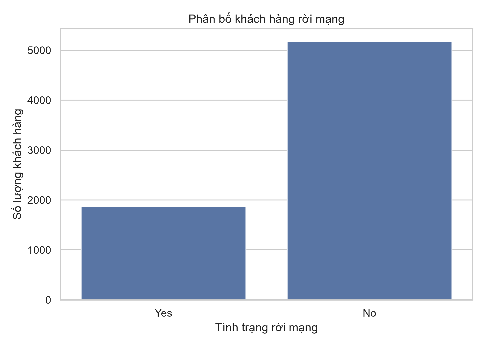
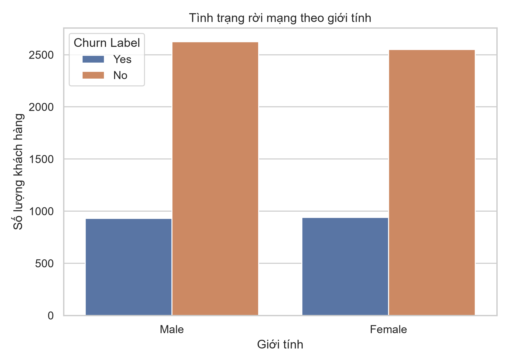
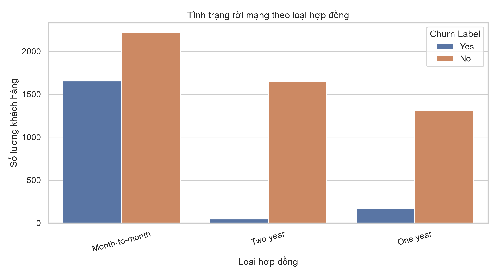
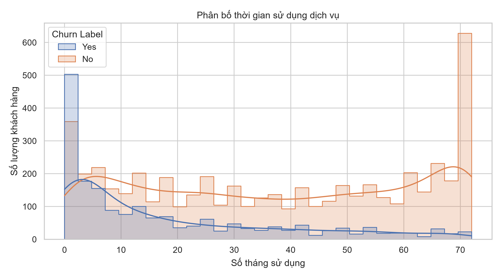
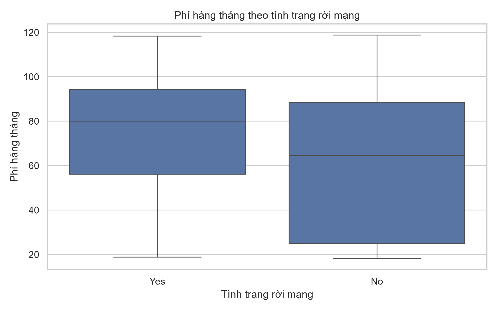
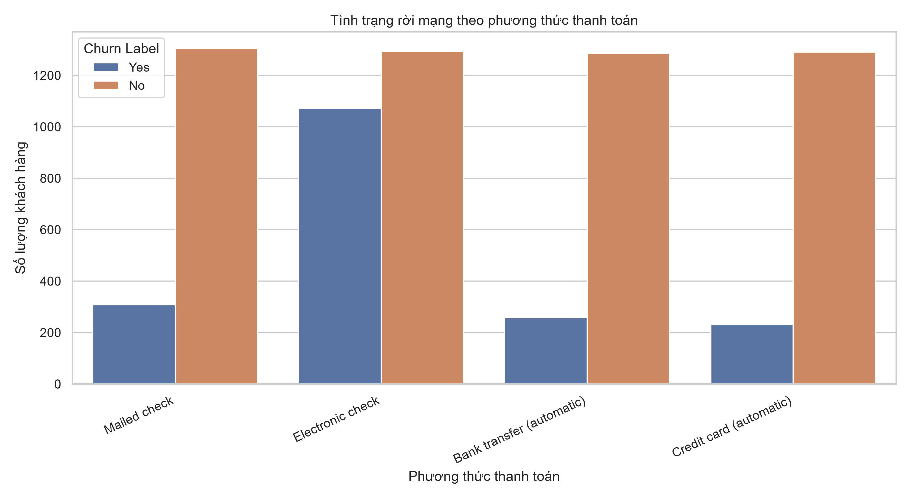
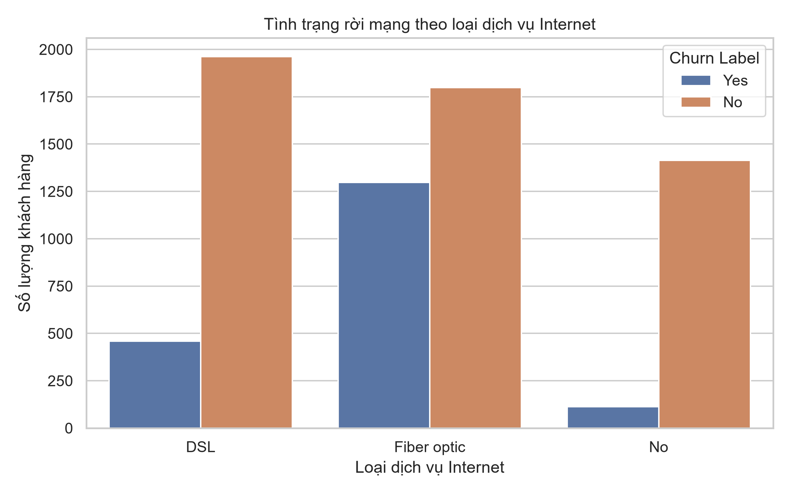

# EDA: Quan sát, ý nghĩa và quyết định

Các tỷ lệ dưới đây được tính trên 7.043 dòng gốc. `notebooks/eda.py` tái tạo
các hình tại `docs/figures/`; phân tích model sử dụng 7.032 dòng sau khi làm
sạch các giá trị thiếu/không hợp lệ ở trường chi phí.

## 1. Phân bố khách hàng rời mạng

- **Hình cho thấy gì:** 5.174 khách hàng không churn (73,46%) và 1.869 churn (26,54%).
- **Ý nghĩa:** Nhãn có mất cân bằng; Accuracy đơn lẻ có thể che khuất khả năng bỏ sót khách churn.
- **Quyết định tiếp theo:** Dùng stratified split và báo cáo Precision, Recall, F1, ROC-AUC cùng Accuracy.

## 2. Churn theo giới tính

- **Hình cho thấy gì:** Tỷ lệ churn nữ là 26,92%, nam là 26,16%, hai nhóm gần nhau.
- **Ý nghĩa:** Gender không thể hiện chênh lệch lớn trong dữ liệu này.
- **Quyết định tiếp theo:** Giữ Gender để model đánh giá cùng các feature khác; không diễn giải đây là quan hệ nhân quả.

## 3. Churn theo loại hợp đồng

- **Hình cho thấy gì:** Tỷ lệ churn month-to-month là 42,71%, one-year 11,27%, two-year 2,83%.
- **Ý nghĩa:** Nhóm hợp đồng ngắn hạn có tỷ lệ rời mạng cao hơn rõ rệt trong dataset.
- **Quyết định tiếp theo:** Giữ Contract dạng phân loại, One-Hot encode và xem đây là tín hiệu liên hệ, không kết luận nhân quả.

## 4. Thời gian sử dụng dịch vụ

- **Hình cho thấy gì:** Median tenure của nhóm churn là 10 tháng, so với 38 tháng ở nhóm không churn.
- **Ý nghĩa:** Khách hàng mới sử dụng dịch vụ có xu hướng xuất hiện nhiều hơn trong nhóm churn.
- **Quyết định tiếp theo:** Giữ Tenure Months dạng số, scale trong pipeline và tránh chia dữ liệu không stratify.

## 5. Phí hàng tháng

- **Hình cho thấy gì:** Median Monthly Charges là 79,65 ở nhóm churn và 64,43 ở nhóm không churn; phân bố có độ trải rộng.
- **Ý nghĩa:** Mức phí cao hơn có liên hệ với churn trong mẫu, nhưng có thể đi cùng loại dịch vụ và hợp đồng.
- **Quyết định tiếp theo:** Parse thành số, không xóa ngoại lệ tùy tiện, scale trong pipeline và đánh giá cùng các feature dịch vụ.

## 6. Churn theo phương thức thanh toán

- **Hình cho thấy gì:** Tỷ lệ churn Electronic check là 45,29%; Bank transfer 16,71%; Credit card 15,24%; Mailed check 19,11%.
- **Ý nghĩa:** Electronic check là nhóm có churn cao nhất trong các phương thức được quan sát.
- **Quyết định tiếp theo:** Giữ Payment Method dạng phân loại và kiểm tra tương tác với Contract/Internet Service trước khi diễn giải nghiệp vụ.

## 7. Churn theo dịch vụ Internet

- **Hình cho thấy gì:** Tỷ lệ churn Fiber optic là 41,89%, DSL 18,96%, nhóm không dùng Internet 7,40%.
- **Ý nghĩa:** Tỷ lệ churn khác nhau theo loại dịch vụ Internet; đây là tín hiệu phân nhóm đáng khảo sát.
- **Quyết định tiếp theo:** Giữ Internet Service dạng phân loại và One-Hot encode; loại các cột target-derived như `Churn Value`, `Churn Score`, `Churn Reason` để tránh leakage.

Các bước làm sạch, chia train/test và fit preprocessing được triển khai trong
`src/train_model.py`; encoder và scaler chỉ được fit bên trong pipeline trên
từng training fold.
